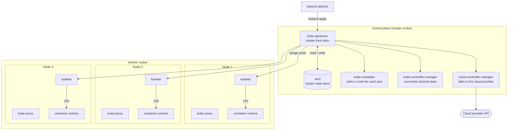
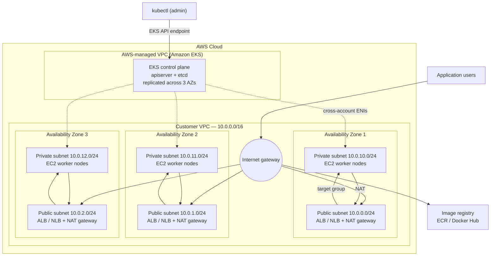

# Kubernetes & Amazon EKS — Architecture Reference

Diagrams below use [Mermaid](https://mermaid.js.org/), which renders natively in GitHub, GitLab, Obsidian, Notion, VS Code (with the Markdown Preview Mermaid extension), and most wikis. Copy the fenced blocks straight into your own docs.

---

## 1. Kubernetes cluster architecture



### Control plane components

| Component | Responsibility | Notes |
|---|---|---|
| `kube-apiserver` | Single entry point for every read and write against cluster state | The only component that talks to `etcd` |
| `etcd` | Consistent key-value store holding all cluster state | Quorum-based; back this up |
| `kube-scheduler` | Binds unscheduled pods to nodes | Filters by resources, taints, affinity, then scores |
| `kube-controller-manager` | Runs the built-in control loops (node, replicaset, endpoints, job, …) | Watches actual state, drives it toward desired state |
| `cloud-controller-manager` | Cloud-specific loops: node lifecycle, routes, load balancers | Split out of `kube-controller-manager` so the core stays cloud-agnostic |

### Worker node components

| Component | Responsibility |
|---|---|
| `kubelet` | Agent on every node; pulls pod specs from the apiserver and makes the runtime match them |
| `kube-proxy` | Programs iptables/IPVS (or eBPF via a CNI) so Service VIPs reach the right pods |
| container runtime | containerd or CRI-O; actually pulls images and runs containers |

### Key architectural rule

Nothing bypasses `kube-apiserver`. Controllers, the scheduler, and every `kubelet` watch the apiserver — they do not talk to `etcd` or to each other. That single choke point is what makes RBAC, admission control, and audit logging possible.

---

## 2. AWS EKS cluster architecture



### Who owns what

| Layer | Owner | Detail |
|---|---|---|
| `kube-apiserver`, `etcd`, scheduler, controller managers | AWS | Runs in an AWS-owned account and VPC, spread over 3 AZs. You never SSH to it |
| Control plane endpoint & auth | Shared | You choose public / private / both, and map IAM to Kubernetes RBAC |
| VPC, subnets, route tables, NAT, security groups | You | Standard VPC resources in your account |
| Worker nodes (EC2, managed node groups, or Fargate) | You | AMI, instance type, scaling, patching |
| Add-ons (CNI, CoreDNS, kube-proxy) | Shared | AWS publishes managed add-on versions; you choose when to upgrade |

### Network layout

| AZ | Public subnet | Private subnet | Contents |
|---|---|---|---|
| AZ 1 | `10.0.0.0/24` | `10.0.10.0/24` | Load balancer + NAT gateway / worker nodes |
| AZ 2 | `10.0.1.0/24` | `10.0.11.0/24` | Load balancer + NAT gateway / worker nodes |
| AZ 3 | `10.0.2.0/24` | `10.0.12.0/24` | Load balancer + NAT gateway / worker nodes |

### Traffic paths

1. **Admin → cluster.** `kubectl` hits the EKS-managed API endpoint. IAM authenticates, RBAC authorizes.
2. **Control plane → nodes.** EKS attaches cross-account elastic network interfaces into your private subnets. This is how `kubectl exec`, `kubectl logs`, and admission webhooks reach workloads.
3. **Inbound app traffic.** Users → internet gateway → ALB/NLB in a public subnet → target group pointing at pods in a private subnet.
4. **Outbound from nodes.** Pods → NAT gateway in the same AZ's public subnet → internet gateway → image registry or third-party APIs. Nodes have no public IPs.

### Required subnet tags

Without these, the AWS Load Balancer Controller cannot place load balancers:

```
# Public subnets
kubernetes.io/role/elb = 1

# Private subnets
kubernetes.io/role/internal-elb = 1

# Both (needed for older controller versions / cluster autoscaler discovery)
kubernetes.io/cluster/<cluster-name> = shared
```

---

## 3. Mapping between the two diagrams

| Upstream Kubernetes | In EKS |
|---|---|
| Master nodes you build and patch | Fully managed, invisible, billed hourly per cluster |
| `etcd` you back up | AWS-managed, encrypted, backed up |
| `cloud-controller-manager` you configure | Built in; provisions ELBs and EBS volumes for you |
| Worker nodes you join manually | EC2 node groups, Karpenter, or Fargate |
| Flat pod network via a CNI overlay | VPC CNI by default — pods get real VPC IPs from the subnet |

---

## Gotchas worth documenting

- **One NAT gateway per AZ.** Cross-AZ NAT traffic costs money and creates a failure dependency between zones.
- **VPC CNI consumes subnet IPs fast.** Every pod takes a real IP from the private subnet. A `/24` (251 usable) fills quickly — size private subnets at `/20` or larger, or enable prefix delegation.
- **Private subnets need a route to the registry.** Either a NAT gateway or VPC endpoints for ECR, S3, and STS.
- **Control plane logging is off by default.** Enable the API, audit, and authenticator log types in CloudWatch before you need them.
- **Version skew.** Worker node kubelet may run up to three minor versions behind the control plane, never ahead. Upgrade the control plane first, then nodes, then add-ons.